# MVP · Pipeline de Dados na Nuvem: E-commerce Olist

Pipeline de dados de ponta a ponta no **Databricks Free Edition** (Unity Catalog + Delta Lake), organizado em
**arquitetura medalhão (Bronze → Silver → Gold)** e com modelagem em **Esquema Estrela**, sobre o dataset público de
e-commerce da Olist. O objetivo é entender como **logística de entrega** e **geografia** afetam a **satisfação dos clientes**
e o **desempenho de vendas** de um marketplace brasileiro.

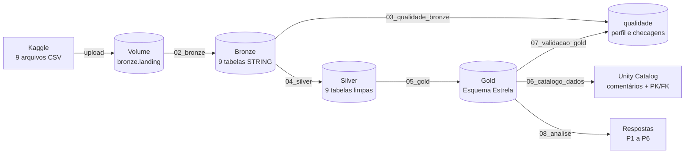

## Sumário

1. [Contexto de Negócio e Perguntas (Etapa 2 e 4.1)](#1-contexto-de-negócio-e-perguntas-etapa-2-e-41)
2. [Carga dos Dados (Etapa 4.2)](#2-carga-dos-dados-etapa-42)
3. [Modelagem e Catálogo de Dados (Etapa 4.3)](#3-modelagem-e-catálogo-de-dados-etapa-43)
4. [Pipeline de Dados (Etapa 4.4)](#4-pipeline-de-dados-etapa-44)
5. [Qualidade de Dados (Etapa 4.5)](#5-qualidade-de-dados-etapa-45)
6. [Análise de Dados (Etapa 4.5)](#6-análise-de-dados-etapa-45)
7. [Autoavaliação](#7-autoavaliação)
8. [Como reproduzir](#8-como-reproduzir)

---

## 1. Contexto de Negócio e Perguntas (Etapa 2 e 4.1)

### 1.1 Problema

A Olist é uma empresa brasileira que conecta pequenos lojistas aos grandes marketplaces. O cliente compra de um
vendedor parceiro, que despacha o produto por transportadora; depois da entrega, o cliente recebe um questionário de satisfação (nota de 1 a 5).

Em um marketplace, o vendedor, a transportadora e o cliente geralmente estão em lugares diferentes do país. A experiência
do cliente, portanto, depende de fatores logísticos que a plataforma não controla totalmente: distância, prazo prometido,
cumprimento do prazo e custo do frete.

> **Problema:** entender **como a logística de entrega e a distribuição geográfica afetam a satisfação dos clientes e o
> desempenho de vendas** do marketplace, para orientar onde a empresa deve agir primeiro.

### 1.2 Perguntas de negócio

| # | Pergunta | Por que importa |
|---|---|---|
| **P1** | O atraso na entrega reduz a nota de avaliação do cliente? Quanto? | Quantifica o custo do atraso em satisfação |
| **P2** | Quais estados (UF) têm o maior prazo médio de entrega e a maior taxa de atraso? | Localiza geograficamente os problemas |
| **P3** | Quais categorias de produto geram mais receita e quais têm a pior avaliação média? | Cruza relevância financeira e satisfação para priorizar categorias |
| **P4** | Como pedidos e receita evoluíram mês a mês? Há sazonalidade (ex.: Black Friday)? | Dimensiona o crescimento e os picos de demanda |
| **P5** | Pedidos interestaduais (vendedor e cliente em UFs diferentes) demoram mais, atrasam mais e pagam mais frete? | Mede o efeito da distância no prazo e no custo |
| **P6** | Qual a forma de pagamento predominante e como o ticket médio varia com o número de parcelas? | Entende o comportamento de compra e o papel do crédito |

Essas perguntas guiaram as decisões técnicas do pipeline:
- **Granularidade:** P1, P2, P5 e P6 são respondidas por pedido; P3 é respondida por item, porque a categoria é do produto. Por isso a Gold tem **duas tabelas fato**.
- **Enriquecimentos:** UF e região do cliente e do vendedor (P2, P5), categoria traduzida (P3), calendário com Black Friday (P4) e forma de pagamento principal (P6).
- **Carga:** a base é histórica, então uma carga completa em lote é suficiente; não há necessidade de tempo real.

### 1.3 Fonte dos dados e licença

| Item | Descrição |
|---|---|
| **Dataset** | *Brazilian E-Commerce Public Dataset by Olist* |
| **Fonte** | Kaggle: https://www.kaggle.com/datasets/olistbr/brazilian-ecommerce |
| **Publicado por** | Olist (dados reais, anonimizados; nomes de empresas substituídos por nomes de personagens de *Game of Thrones* nas avaliações) |
| **Período** | Pedidos de **set/2016 a out/2018** |
| **Volume** | ~100 mil pedidos, 9 arquivos CSV, ~126 MB |
| **Licença** | **CC BY-NC-SA 4.0** (Creative Commons Atribuição-NãoComercial-CompartilhaIgual 4.0) |

**Sobre a licença:** a CC BY-NC-SA 4.0 permite **copiar, adaptar e redistribuir** os dados desde que:
(1) seja dado **crédito** à Olist (**BY**); (2) o uso **não seja comercial** (**NC**), o que é o caso deste trabalho acadêmico; e
(3) obras derivadas sejam distribuídas **sob a mesma licença** (**SA**). Por isso os dados **não são versionados** neste
repositório (ver `.gitignore`). Eles devem ser baixados diretamente do Kaggle. O código deste repositório está sob licença MIT.

### 1.4 Estrutura dos dados brutos

Os dados vêm **normalizados** em 9 arquivos relacionados por chaves:

| Arquivo | Linhas | Colunas | Conteúdo |
|---|---:|---:|---|
| `olist_orders_dataset.csv` | 99.441 | 8 | Pedidos: status e 5 datas do ciclo (compra, aprovação, envio, entrega, estimativa) |
| `olist_order_items_dataset.csv` | 112.650 | 7 | Itens de cada pedido: produto, vendedor, preço, frete |
| `olist_order_payments_dataset.csv` | 103.886 | 5 | Pagamentos: forma, parcelas, valor (um pedido pode ter vários) |
| `olist_order_reviews_dataset.csv` | 99.224 | 7 | Avaliações: nota 1–5, título e comentário |
| `olist_customers_dataset.csv` | 99.441 | 5 | Clientes: CEP (5 dígitos), cidade, UF |
| `olist_sellers_dataset.csv` | 3.095 | 4 | Vendedores: CEP, cidade, UF |
| `olist_products_dataset.csv` | 32.951 | 9 | Produtos: categoria (PT), tamanho do nome/descrição, fotos, peso e dimensões |
| `olist_geolocation_dataset.csv` | 1.000.163 | 5 | Pontos de latitude/longitude por prefixo de CEP |
| `product_category_name_translation.csv` | 71 | 2 | Tradução das categorias PT → EN |

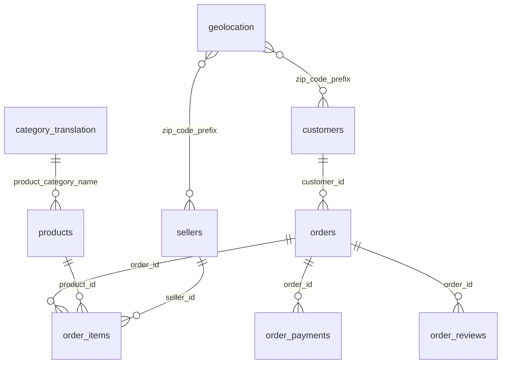

---

## 2. Carga dos Dados (Etapa 4.2)

### 2.1 Como foi feita

1. **Download** do ZIP no Kaggle (autenticado) e extração dos 9 CSVs.
2. **Criação da estrutura** no Unity Catalog pelo notebook [`01_setup`](notebooks/01_setup.py): catálogo `olist`,
   schemas `bronze`, `silver`, `gold` e `qualidade`, e o **Volume** `olist.bronze.landing` (armazenamento de arquivos gerenciado pelo Unity Catalog).
3. **Upload** dos 9 CSVs para o Volume pela interface do Databricks
   (*Catalog → olist → bronze → Volumes → landing → Upload to this volume*). O próprio `01_setup` confere se os 9 arquivos chegaram.
4. **Ingestão** para tabelas Delta pelo notebook [`02_bronze`](notebooks/02_bronze.py):
   - leitura com todas as colunas como `STRING` (sem inferência de tipos), preservando o dado original (ex.: CEPs com zero à esquerda);
   - `multiLine=true` e `escape='"'`, necessários porque comentários das avaliações contêm quebras de linha;
   - adição dos metadados `_ingestion_ts` (momento da carga) e `_source_file` (arquivo de origem);
   - carga completa (`overwrite`), **idempotente**;
   - **conferência automática** do número de linhas carregadas com o número de linhas de cada arquivo (falha se divergir).

> Por que Volume + Bronze? O Volume guarda o **arquivo original** (evidência imutável). A tabela Bronze guarda o **mesmo conteúdo em
> formato Delta**, consultável via SQL, com transações ACID e histórico (*time travel*).

### 2.2 Evidências

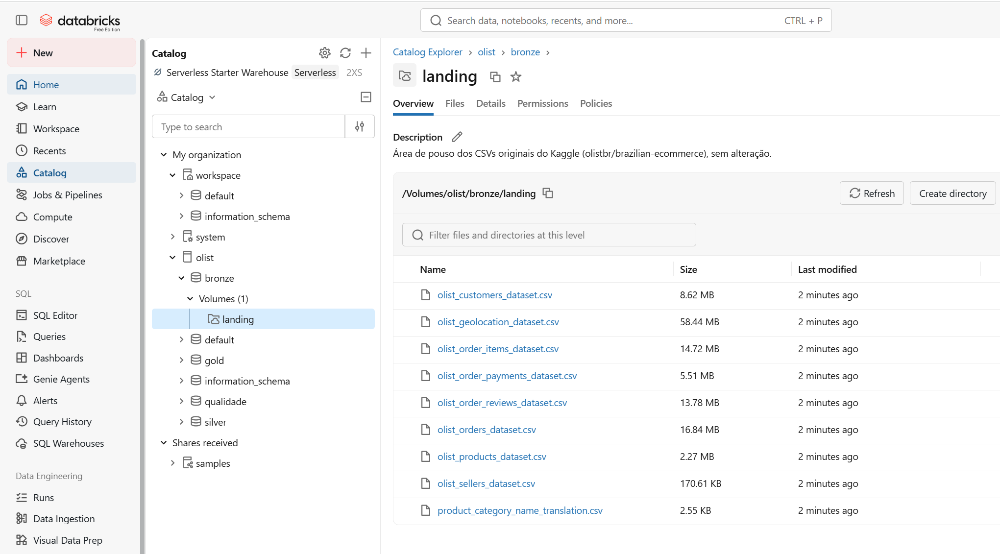
*Os 9 CSVs no Volume `olist.bronze.landing`.*

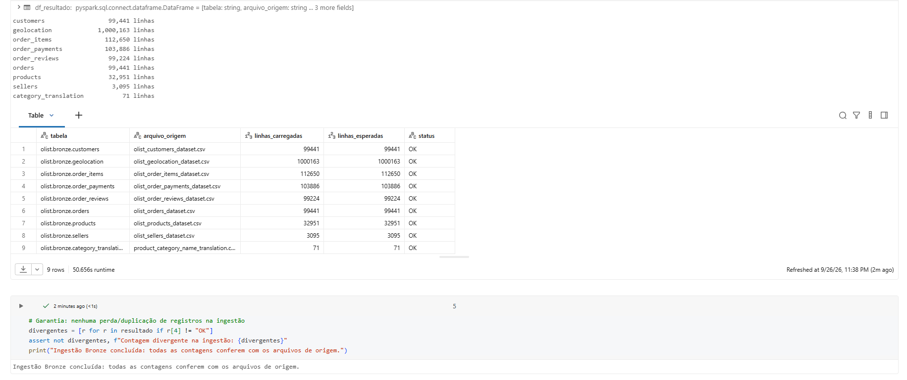
*Notebook `02_bronze`: contagem de linhas carregadas × esperadas (todas OK).*

---

## 3. Modelagem e Catálogo de Dados (Etapa 4.3)

### 3.1 Organização em camadas (arquitetura medalhão)

Um catálogo `olist` com um **schema por camada**:

| Schema | Tabelas | Propósito |
|---|---|---|
| `olist.bronze` | 9 (+ Volume `landing`) | Dado como chegou, tudo `STRING`, com metadados de ingestão |
| `olist.silver` | 9 | Dado limpo, tipado, deduplicado e padronizado, com os nomes da fonte |
| `olist.gold` | 6 | **Esquema Estrela** para análise, com nomes em português |
| `olist.qualidade` | 4 | Resultados das verificações de qualidade |

### 3.2 Modelo dimensional (Gold): Esquema Estrela

Escolhi o **Esquema Estrela** porque as perguntas são analíticas (agregações por UF, categoria, mês e forma de pagamento), e esse é o
formato em que essas consultas ficam mais simples e rápidas. Como as perguntas exigem **dois grãos diferentes** (pedido e item),
o modelo tem **duas tabelas fato que compartilham as mesmas dimensões** (constelação de fatos).

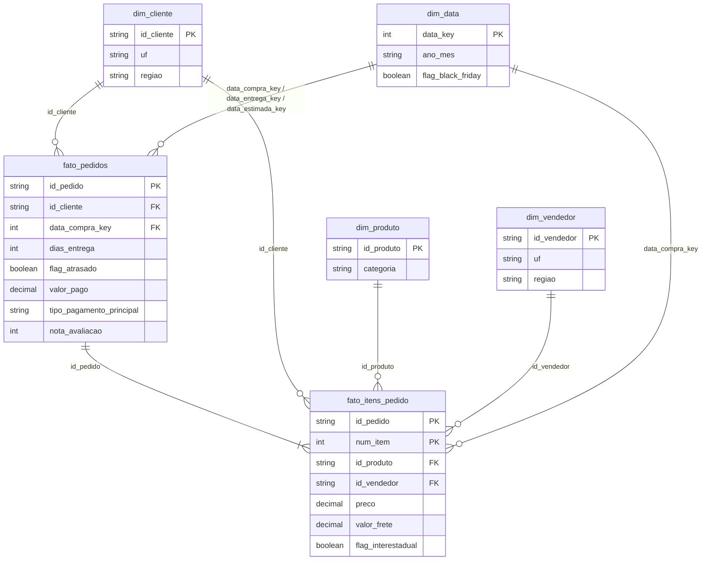

| Tabela | Tipo | Grão | Linhas (aprox.) |
|---|---|---|---:|
| `fato_pedidos` | Fato | 1 pedido | 99.441 |
| `fato_itens_pedido` | Fato | 1 item de pedido | 112.650 |
| `dim_cliente` | Dimensão | 1 customer_id | 99.441 |
| `dim_vendedor` | Dimensão | 1 seller_id | 3.095 |
| `dim_produto` | Dimensão | 1 product_id | 32.951 |
| `dim_data` | Dimensão | 1 dia (set/2016 a nov/2018) | ~800 |

**Decisões de modelagem:**
- **Chaves naturais** (hashes da Olist) foram mantidas como chaves das dimensões. Elas já são únicas e estáveis, e como não há
  histórico de mudanças de atributos (SCD), chaves substitutas não trariam benefício neste MVP.
- `dim_data` usa a chave inteira `AAAAMMDD` e é uma dimensão com **múltiplos papéis** (*role-playing*) na `fato_pedidos` (data da compra, da entrega e estimada).
- `nota_avaliacao` foi **replicada** na `fato_itens_pedido` (atributo do pedido) para responder à P3 sem um JOIN entre fatos.
- Pagamentos foram **agregados** na `fato_pedidos` (valor total, parcelas, forma principal), pois as perguntas analisam o pedido, e não cada transação.
- **PKs e FKs** estão registradas como *constraints* no Unity Catalog, e o relacionamento aparece no Catalog Explorer.

### 3.3 Catálogo de Dados

O catálogo foi implementado **no próprio Unity Catalog** pelo notebook [`06_catalogo_dados`](notebooks/06_catalogo_dados.py):
todas as tabelas das 3 camadas têm **descrição da tabela** e **descrição de cada coluna**, incluindo **domínio** e **linhagem**.
A linhagem entre tabelas e colunas também é capturada **automaticamente** pelo Unity Catalog (aba *Lineage*).

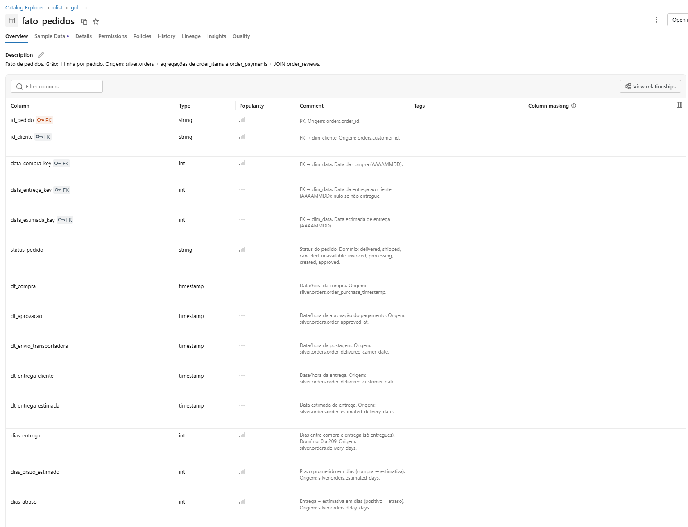
*Catalog Explorer: `gold.fato_pedidos` com descrição da tabela e de cada coluna.*

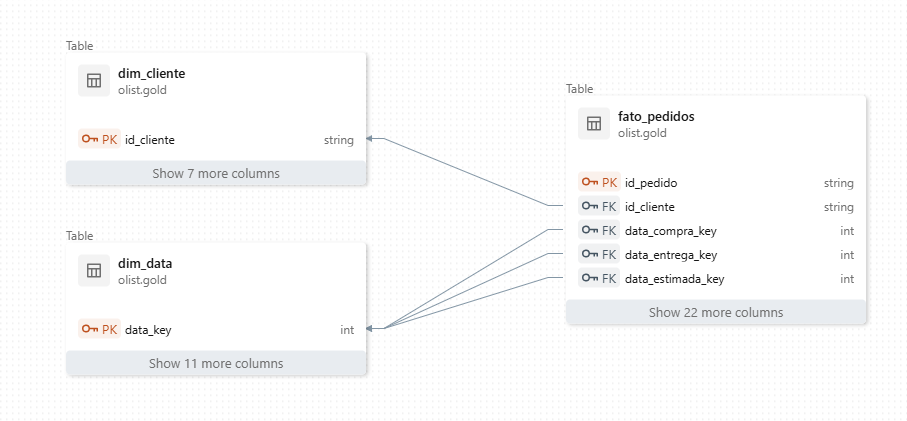
*Relacionamentos PK/FK do modelo estrela no Catalog Explorer.*

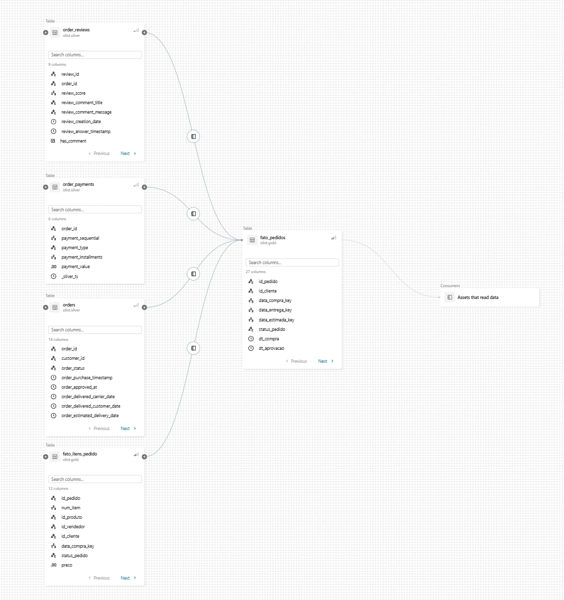
*Aba Lineage: `bronze → silver → gold` gerada automaticamente pelo Unity Catalog.*

A seguir, a **transcrição do catálogo** da camada Gold (consumo analítico). Os domínios foram verificados nos dados.

#### `gold.fato_pedidos`: 1 linha por pedido
Origem: `silver.orders` + agregações de `silver.order_items` e `silver.order_payments` + JOIN `silver.order_reviews`.

| Coluna | Tipo | Descrição | Domínio | Linhagem |
|---|---|---|---|---|
| id_pedido | STRING | **PK.** Identificador do pedido | hash 32 caracteres | orders.order_id |
| id_cliente | STRING | **FK** → dim_cliente | hash 32 caracteres | orders.customer_id |
| data_compra_key | INT | **FK** → dim_data. Data da compra | 20160904 a 20181017 | orders.order_purchase_timestamp (AAAAMMDD) |
| data_entrega_key | INT | **FK** → dim_data. Data da entrega | nulo se não entregue | orders.order_delivered_customer_date |
| data_estimada_key | INT | **FK** → dim_data. Data estimada | — | orders.order_estimated_delivery_date |
| status_pedido | STRING | Status do pedido | delivered, shipped, canceled, unavailable, invoiced, processing, created, approved | orders.order_status |
| dt_compra | TIMESTAMP | Data/hora da compra | 2016-09-04 a 2018-10-17 | orders.order_purchase_timestamp |
| dt_aprovacao | TIMESTAMP | Aprovação do pagamento | nulo em 160 pedidos | orders.order_approved_at |
| dt_envio_transportadora | TIMESTAMP | Postagem na transportadora | nulo se não enviado | orders.order_delivered_carrier_date |
| dt_entrega_cliente | TIMESTAMP | Entrega ao cliente | nulo se não entregue | orders.order_delivered_customer_date |
| dt_entrega_estimada | TIMESTAMP | Data prometida ao cliente | — | orders.order_estimated_delivery_date |
| dias_entrega | INT | Dias entre compra e entrega (só entregues) | 0 a 209 | **derivada**: datediff(entrega, compra) |
| dias_prazo_estimado | INT | Prazo prometido em dias | 2 a 156 | **derivada**: datediff(estimada, compra) |
| dias_atraso | INT | Entrega − estimativa (positivo = atraso) | −147 a 188 | **derivada**: datediff(entrega, estimada) |
| flag_atrasado | BOOLEAN | Entregue após a data estimada | true/false; nulo se não entregue | **derivada** |
| flag_inconsistencia_datas | BOOLEAN | Sequência de datas inconsistente na origem | true/false | **derivada** |
| qtd_itens | INT | Itens no pedido | 0 a 21 | COUNT(order_items) |
| qtd_vendedores | INT | Vendedores distintos no pedido | 0 a 5 | COUNT DISTINCT(order_items.seller_id) |
| valor_produtos | DECIMAL(12,2) | Soma dos preços dos itens (R$) | > 0; nulo se sem itens | SUM(order_items.price) |
| valor_frete | DECIMAL(12,2) | Soma dos fretes (R$) | ≥ 0 | SUM(order_items.freight_value) |
| valor_pago | DECIMAL(12,2) | Total pago (R$) | 0 a 13.664,08 | SUM(order_payments.payment_value) |
| tipo_pagamento_principal | STRING | Forma de maior valor no pedido | credit_card, boleto, voucher, debit_card, not_defined | order_payments.payment_type (maior valor) |
| qtd_parcelas | INT | Maior nº de parcelas do pedido | 1 a 24 | MAX(order_payments.payment_installments) |
| qtd_formas_pagamento | INT | Formas de pagamento distintas | 1 a 2 | COUNT DISTINCT(payment_type) |
| flag_interestadual | BOOLEAN | Algum item com vendedor de outra UF | true/false | **derivada**: seller_state ≠ customer_state |
| nota_avaliacao | INT | Nota do cliente | 1 a 5; nulo se não avaliado | order_reviews.review_score |
| flag_comentario | BOOLEAN | Avaliação com comentário escrito | true/false | order_reviews.has_comment |

#### `gold.fato_itens_pedido`: 1 linha por item de pedido
Origem: `silver.order_items` JOIN `orders`, `customers`, `sellers`, `order_reviews`.

| Coluna | Tipo | Descrição | Domínio | Linhagem |
|---|---|---|---|---|
| id_pedido | STRING | **PK (1/2)**, **FK** → fato_pedidos | hash | order_items.order_id |
| num_item | INT | **PK (2/2).** Sequência do item no pedido | 1 a 21 | order_items.order_item_id |
| id_produto | STRING | **FK** → dim_produto | hash | order_items.product_id |
| id_vendedor | STRING | **FK** → dim_vendedor | hash | order_items.seller_id |
| id_cliente | STRING | **FK** → dim_cliente | hash | JOIN orders.customer_id |
| data_compra_key | INT | **FK** → dim_data | AAAAMMDD | JOIN orders.order_purchase_timestamp |
| status_pedido | STRING | Status do pedido | 8 status (ver acima) | JOIN orders.order_status |
| preco | DECIMAL(12,2) | Preço do item (R$) | 0,85 a 6.735,00 | order_items.price |
| valor_frete | DECIMAL(12,2) | Frete do item (R$) | 0 a 409,68 | order_items.freight_value |
| valor_total_item | DECIMAL(12,2) | Preço + frete (R$) | > 0 | **derivada** |
| flag_interestadual | BOOLEAN | UF do vendedor ≠ UF do cliente | true/false | **derivada** (JOIN sellers e customers) |
| nota_avaliacao | INT | Nota do pedido do item | 1 a 5; nulo se não avaliado | JOIN order_reviews.review_score |

#### `gold.dim_cliente`: 1 linha por cliente-pedido
| Coluna | Tipo | Descrição | Domínio | Linhagem |
|---|---|---|---|---|
| id_cliente | STRING | **PK** | hash | customers.customer_id |
| id_cliente_unico | STRING | Identifica a pessoa (compras recorrentes) | 96.096 valores | customers.customer_unique_id |
| cep_prefixo | STRING | 5 primeiros dígitos do CEP | 01003 a 99990 | customers.customer_zip_code_prefix (lpad 5) |
| cidade | STRING | Cidade (minúsculas, sem acento) | ~4.100 cidades | customers.customer_city (padronizada) |
| uf | STRING | Unidade Federativa | 27 UFs | customers.customer_state |
| regiao | STRING | Região IBGE | Norte, Nordeste, Centro-Oeste, Sudeste, Sul | **derivada** da UF |
| latitude | DOUBLE | Latitude mediana do CEP | −33,75 a 5,27 | JOIN silver.geolocation |
| longitude | DOUBLE | Longitude mediana do CEP | −73,99 a −34,79 | JOIN silver.geolocation |

#### `gold.dim_vendedor`: 1 linha por vendedor
| Coluna | Tipo | Descrição | Domínio | Linhagem |
|---|---|---|---|---|
| id_vendedor | STRING | **PK** | hash | sellers.seller_id |
| cep_prefixo | STRING | 5 primeiros dígitos do CEP | 5 dígitos | sellers.seller_zip_code_prefix |
| cidade | STRING | Cidade limpa | texto; nulo se inválida na origem | sellers.seller_city (limpeza) |
| uf | STRING | UF | 23 UFs presentes | sellers.seller_state |
| regiao | STRING | Região IBGE | 5 regiões | **derivada** da UF |
| latitude / longitude | DOUBLE | Coordenadas medianas do CEP | território brasileiro | JOIN silver.geolocation |

#### `gold.dim_produto`: 1 linha por produto
| Coluna | Tipo | Descrição | Domínio | Linhagem |
|---|---|---|---|---|
| id_produto | STRING | **PK** | hash | products.product_id |
| categoria | STRING | Categoria em português | 73 categorias + `sem_categoria` | products.product_category_name |
| categoria_en | STRING | Categoria em inglês | 73 + `uncategorized` | JOIN category_translation |
| qtd_caracteres_nome | INT | Tamanho do nome | 5 a 76 | products.product_name_lenght |
| qtd_caracteres_descricao | INT | Tamanho da descrição | 4 a 3.992 | products.product_description_lenght |
| qtd_fotos | INT | Fotos publicadas | 1 a 20 | products.product_photos_qty |
| peso_g | DOUBLE | Peso (g) | 2 a 40.425 | products.product_weight_g (0 → nulo) |
| comprimento_cm / altura_cm / largura_cm | DOUBLE | Dimensões (cm) | 7–105 / 2–105 / 6–118 | products.* |
| volume_cm3 | DOUBLE | Volume (cm³) | > 0 | **derivada**: C × A × L |

#### `gold.dim_data`: 1 linha por dia
| Coluna | Tipo | Descrição | Domínio |
|---|---|---|---|
| data_key | INT | **PK.** Data AAAAMMDD | 20160904 em diante |
| data | DATE | Data | set/2016 a nov/2018 |
| ano / trimestre / mes / dia | INT | Partes da data | 2016–2018 / 1–4 / 1–12 / 1–31 |
| nome_mes | STRING | Mês por extenso | Janeiro a Dezembro |
| ano_mes | STRING | Ano-mês | AAAA-MM |
| dia_semana / nome_dia_semana | INT / STRING | Dia da semana | 1 (Domingo) a 7 (Sábado) |
| flag_fim_de_semana | BOOLEAN | Sábado ou domingo | true/false |
| flag_black_friday | BOOLEAN | Sexta-feira de Black Friday | true/false |

Linhagem: gerada no pipeline (`sequence` entre a menor e a maior data de `silver.orders`).

#### Camadas Silver e Bronze
As tabelas Silver e Bronze também estão documentadas no Unity Catalog (descrição da tabela e de todas as colunas, com domínios).
Na Bronze, cada coluna é descrita como *"Valor bruto (STRING, sem tratamento)"* seguido do significado do campo.
O catálogo completo pode ser consultado com a última célula do notebook `06_catalogo_dados` (consulta ao `information_schema`).

---

## 4. Pipeline de Dados (Etapa 4.4)

### 4.1 Organização

O pipeline foi **dividido em um notebook por etapa** (um ETL por camada). Cada um é reexecutável (cargas `overwrite`) e
todos compartilham parâmetros via `%run ./00_config`. A execução é orquestrada por um **Job do Databricks** (Lakeflow Jobs)
com dependências em sequência.

| Ordem | Notebook | Etapa | Lê de | Grava em |
|---:|---|---|---|---|
| — | [`00_config`](notebooks/00_config.py) | Parâmetros (catálogo, schemas, arquivos, UF→Região) | — | — |
| 1 | [`01_setup`](notebooks/01_setup.py) | Cria schemas e Volume; confere arquivos | — | `bronze`, `silver`, `gold`, `qualidade` |
| 2 | [`02_bronze`](notebooks/02_bronze.py) | **E + L**: CSV → Delta sem alteração | Volume `landing` | `bronze.*` (9) |
| 3 | [`03_qualidade_bronze`](notebooks/03_qualidade_bronze.py) | Perfil de qualidade do dado bruto | `bronze.*` | `qualidade.*_bronze` (3) |
| 4 | [`04_silver`](notebooks/04_silver.py) | **T**: limpeza, tipagem, deduplicação | `bronze.*` | `silver.*` (9) |
| 5 | [`05_gold`](notebooks/05_gold.py) | **T**: modelo estrela (JOINs e agregações) | `silver.*` | `gold.*` (6) |
| 6 | [`06_catalogo_dados`](notebooks/06_catalogo_dados.py) | Catálogo: comentários + PK/FK | — | metadados do Unity Catalog |
| 7 | [`07_validacao_gold`](notebooks/07_validacao_gold.py) | Testes de qualidade da Gold (falha o Job se violar) | `gold.*`, `silver.*` | `qualidade.validacao_gold` |
| 8 | [`08_analise`](notebooks/08_analise.py) | Respostas P1 a P6 | `gold.*` | — |

### 4.2 Principais transformações

**Bronze → Silver** ([`04_silver`](notebooks/04_silver.py)):

| Tabela | Transformação | Por quê / impacto |
|---|---|---|
| todas | `try_cast` de STRING para TIMESTAMP, DECIMAL(12,2), INT e DOUBLE | Tipos corretos para cálculos; valor inválido vira nulo em vez de quebrar o pipeline |
| orders | Derivação de `delivery_days`, `estimated_days`, `delay_days`, `is_late`, `has_date_inconsistency` | Métricas de prazo usadas em P1, P2, P5 |
| order_reviews | Deduplicação: **1 avaliação por pedido** (a mais recente) | 551 pedidos tinham várias avaliações; evita contar o pedido duas vezes. 99.224 → 98.673 linhas |
| order_reviews | Texto vazio → nulo; flag `has_comment` | Padronização |
| order_payments | Parcelas 0 → 1 | 2 registros com valor impossível |
| products | Correção `lenght` → `length`; categoria nula → `sem_categoria`; peso 0 → nulo; volume | 610 produtos sem categoria continuam na análise de receita |
| products | **JOIN** com `category_translation` (+2 traduções faltantes adicionadas) | Categoria em inglês para todos os produtos |
| customers / sellers | CEP com 5 dígitos (`lpad`), UF maiúscula, cidade sem acentos e em minúsculas | Padronização para JOINs e agrupamentos |
| sellers | Limpeza de cidade: corte em `/`, `,`, `\`; e-mail/números → nulo | Ex.: `"sao paulo / sao paulo"` → `"sao paulo"` |
| geolocation | Remove 261.831 duplicatas e 42 pontos fora do Brasil; **agrega para 1 linha por CEP** (mediana lat/lng) | 1.000.163 → ~19 mil linhas; vira uma referência usável em JOIN sem multiplicar linhas |

**Silver → Gold** ([`05_gold`](notebooks/05_gold.py)):
- **JOIN** de `order_items` com `orders` pelo `order_id`, trazendo cliente, data e status de cada item;
- **JOIN** com `customers` e `sellers` para calcular `flag_interestadual` (UF do vendedor ≠ UF do cliente);
- **JOIN** com `order_reviews` para levar a nota do pedido aos itens;
- **Agregação** de itens (quantidade, valor, frete, nº de vendedores) e de pagamentos (valor pago, parcelas, forma principal por *window function*) por pedido;
- **JOIN** de clientes e vendedores com `geolocation` pelo CEP (lat/lng) e mapeamento **UF → região**;
- Geração da `dim_data` por `sequence()` de datas.

### 4.3 Evidências


*Job `pipeline_olist`: tarefas encadeadas e execução concluída com sucesso.*

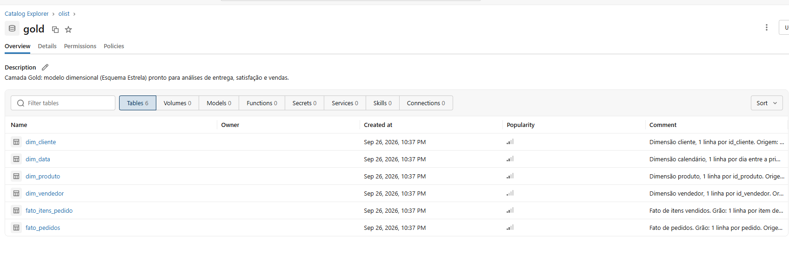
*Catalog Explorer: tabelas Delta persistidas nos schemas `bronze`, `silver`, `gold` e `qualidade`.*


*Amostra da `gold.fato_pedidos` (aba Sample Data).*

---

## 5. Qualidade de Dados (Etapa 4.5)

A qualidade foi verificada em **dois momentos**:
1. **Antes de transformar** ([`03_qualidade_bronze`](notebooks/03_qualidade_bronze.py)): perfil de **completude de todos os atributos** de todas as tabelas,
   além de **38 checagens** de consistência, unicidade, acurácia e integridade referencial, e da análise de outliers (IQR).
   Cada checagem registra o tratamento aplicado na Silver.
2. **Depois de modelar** ([`07_validacao_gold`](notebooks/07_validacao_gold.py)): 27 regras sobre a Gold (unicidade de PK,
   FK órfã, reconciliação de contagens e valores com a Silver, domínios). O notebook **interrompe o Job** se alguma regra falhar.

### 5.1 Problemas encontrados e tratamentos

| Dimensão | Tabela.atributo | Problema detectado | Qtd. | Tratamento |
|---|---|---|---:|---|
| Completude | reviews.comment_title / message | Títulos e comentários vazios | 88,3% / 58,7% | Mantidos como nulo (comentário é opcional); flag `has_comment` |
| Completude | orders.order_approved_at / delivered_carrier / delivered_customer | Datas nulas | 160 / 1.783 / 2.965 | Esperado para pedidos não aprovados/enviados/entregues; métricas de prazo só para entregues |
| Completude | products.category e atributos de texto | Categoria nula | 610 (1,9%) | `sem_categoria` / `uncategorized` |
| Completude | products.weight e dimensões | Nulos | 2 | Mantidos nulos |
| Unicidade | reviews.order_id | Pedido com mais de uma avaliação | 551 pedidos (202 com notas diferentes) | Mantida a mais recente |
| Unicidade | reviews.review_id | Mesma avaliação em pedidos diferentes | 814 | Chave passa a ser (review_id, order_id) |
| Unicidade | geolocation | Linhas idênticas | 261.831 (26%) | Removidas |
| Unicidade | geolocation.zip_code_prefix | Vários pontos por CEP | 1.000.163 linhas / 19.015 CEPs | Agregado por CEP (mediana) |
| Unicidade | customers.customer_unique_id | Mesma pessoa com vários customer_id | 3.345 | Comportamento da fonte (1 id por pedido); mantido |
| Consistência | sellers.seller_city | Cidade com UF, barra, vírgula, CEP ou e-mail | 24 | Limpeza por regra; inválidos → nulo |
| Consistência | geolocation.city | Acentos e grafias variantes (`são paulo`, `sao paulo`, `sa~o paulo`) | milhares | Remoção de acentos e diacríticos |
| Consistência | products.category | Categorias sem tradução | 2 | Tradução adicionada |
| Consistência | category_translation | Caractere BOM no cabeçalho | 1 | Removido do nome da coluna na ingestão |
| Consistência | order_payments.payment_type | `not_defined` | 3 | Mantido (pedidos cancelados, valor 0) |
| Acurácia | order_payments.installments | Parcelas = 0 | 2 | Corrigido para 1 |
| Acurácia | order_payments.value | Valor = 0 | 9 | Mantido (vouchers) |
| Acurácia | products.weight_g | Peso = 0 | 4 | → nulo |
| Acurácia | geolocation.lat/lng | Coordenadas fora do Brasil | 42 | Removidas |
| Acurácia | orders | Status `delivered` sem data de entrega | 8 | Métricas de prazo nulas |
| Acurácia | orders | Não entregue, mas com data de entrega | 6 | Métricas só para status `delivered` |
| Acurácia | orders | Envio antes da compra / entrega antes do envio | 166 / 23 | Flag `has_date_inconsistency`; prazo compra→entrega não é afetado |
| Integridade | orders × order_items | Pedidos sem itens | 775 (quase todos `unavailable`/`canceled`) | Mantidos na `fato_pedidos` com `qtd_itens = 0` |
| Integridade | orders × order_reviews | Pedidos sem avaliação | 768 | `nota_avaliacao` nula; análises de nota filtram avaliados |
| Integridade | customers × geolocation | CEP sem coordenada | 279 | Lat/lng nulos (não usados nas perguntas) |
| Outliers | order_items.price | Acima de Q3 + 1,5·IQR (máx. R$ 6.735) | ~7,5% | **Mantidos** (produtos caros são legítimos); análises usam também medianas |
| Outliers | orders (derivado) dias_entrega | Entregas de até 209 dias | ~5% | Mantidos (atrasos reais); faixas de atraso na P1 |

**Sem problemas:** unicidade das chaves de orders, items, payments, products e sellers; datas todas parseáveis; UFs válidas;
CEPs com 5 dígitos; preços > 0; notas entre 1 e 5; integridade de items → products/sellers e orders → customers.

### 5.2 Evidências

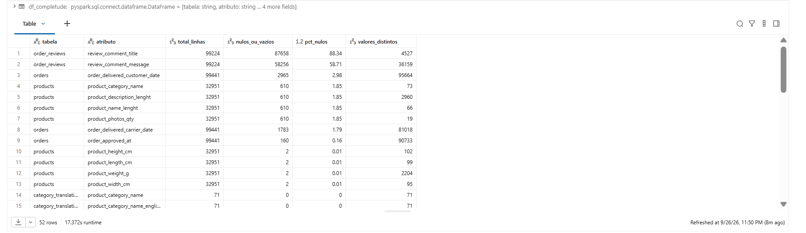
*Completude de todos os atributos da Bronze (`qualidade.perfil_completude_bronze`).*

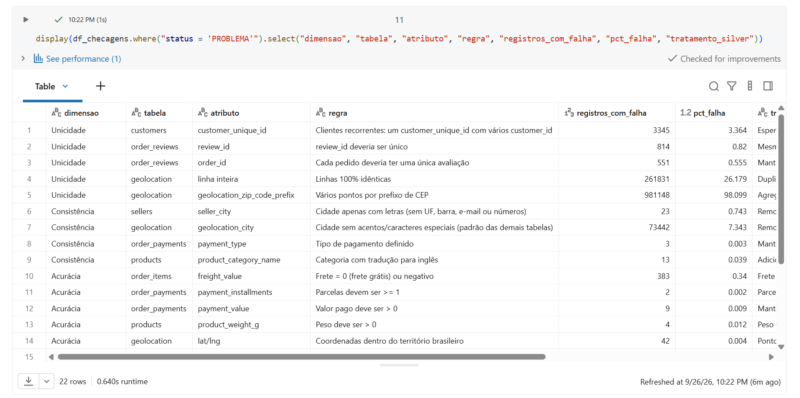
*Checagens com status e tratamento aplicado (`qualidade.checagens_bronze`).*

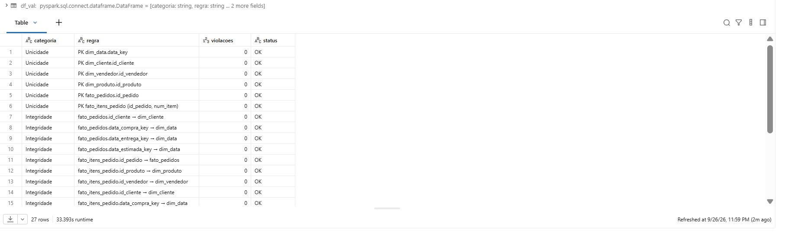
*Todas as regras de validação da Gold com 0 violações (`qualidade.validacao_gold`).*

---

## 6. Análise de Dados (Etapa 4.5)

Todas as respostas foram obtidas com SQL sobre a **camada Gold** no notebook [`08_analise`](notebooks/08_analise.py).

### P1. O atraso na entrega reduz a nota de avaliação? Quanto?

| Situação | Pedidos | Nota média | % notas 1–2 | % nota 5 |
|---|---:|---:|---:|---:|
| No prazo | 89.443 | **4,29** | 9,3% | 62,3% |
| Com atraso | 6.381 | **2,27** | 62,4% | 16,5% |

| Faixa de atraso | Pedidos | Nota média | % notas 1–2 |
|---|---:|---:|---:|
| No prazo | 89.443 | 4,29 | 9,3% |
| 1–3 dias | 1.852 | 3,29 | 32,1% |
| 4–7 dias | 1.748 | 2,10 | 67,7% |
| 8–14 dias | 1.446 | 1,67 | 80,2% |
| 15+ dias | 1.335 | 1,72 | 78,4% |

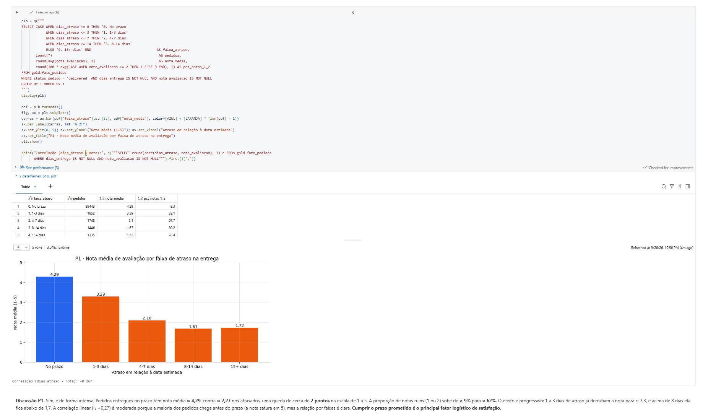

**Discussão:** sim, e de forma intensa. O atraso derruba a nota média em **~2 pontos** (4,29 → 2,27) e faz a proporção de
notas ruins saltar de 9% para 62%. O efeito é **progressivo**: 1 a 3 dias de atraso já custam 1 ponto, e acima de uma semana
80% das notas são 1 ou 2. A correlação linear é moderada (≈ −0,27) porque a maioria dos pedidos chega antes do prazo e a nota
"satura" em 5, mas a relação por faixas é inequívoca: **cumprir o prazo prometido é o principal fator logístico de satisfação**.

### P2. Quais estados têm maior prazo e maior taxa de atraso?

| UF | Pedidos entregues | Prazo médio (dias) | Prazo prometido (dias) | % atraso |
|---|---:|---:|---:|---:|
| RR | 41 | **29,3** | 46,6 | 12,2% |
| AP | 67 | **27,2** | 46,9 | 3,0% |
| AM | 145 | **26,4** | 45,9 | 2,8% |
| AL | 397 | 24,5 | 33,2 | **21,4%** |
| PA | 946 | 23,7 | 37,8 | 11,2% |
| MA | 717 | 21,5 | 31,1 | **17,4%** |
| SE | 335 | 21,5 | 31,5 | **15,2%** |
| … | | | | |
| RJ | 12.350 | 15,2 | 27,0 | 12,1% |
| MG | 11.354 | 11,9 | 25,2 | 4,6% |
| PR | 4.923 | 11,9 | 25,3 | 4,0% |
| SP | 40.494 | **8,7** | 19,8 | 4,5% |
| **Brasil** | 96.470 | 12,5 | 24,4 | 6,8% |

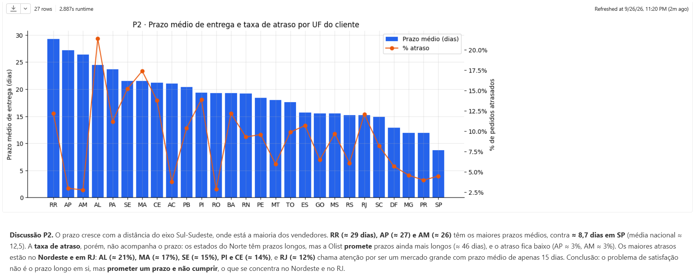

**Discussão:** o prazo cresce com a distância do eixo Sul-Sudeste, onde está a maioria dos vendedores. O Norte tem os maiores prazos
(RR, AP e AM, com 26 a 29 dias, contra 8,7 em SP). Porém, **prazo longo ≠ atraso**: no Norte a Olist promete ~46 dias, e o
atraso fica baixo (AP e AM ≈ 3%). Os **maiores atrasos** estão no **Nordeste** (AL 21%, MA 17%, SE 15%, PI e CE 14%) e no
**RJ (12%)**, que é o 2º maior mercado e tem atraso quase 3 vezes maior que SP e MG. O problema não é o prazo ser longo, mas
**prometer e não cumprir**, o que, pela P1, é o que destrói a satisfação.

### P3. Quais categorias geram mais receita e quais têm a pior avaliação?

| Top 5 receita | Receita (R$) | % | Nota | | Piores notas (≥ 500 itens) | Nota |
|---|---:|---:|---:|---|---|---:|
| beleza_saude | 1.258.681 | 9,3% | 4,14 | | moveis_escritorio | **3,49** |
| relogios_presentes | 1.205.006 | 8,9% | 4,02 | | sem_categoria | 3,84 |
| cama_mesa_banho | 1.036.989 | 7,6% | **3,90** | | cama_mesa_banho | 3,90 |
| esporte_lazer | 988.049 | 7,3% | 4,11 | | moveis_sala | 3,90 |
| informatica_acessorios | 911.954 | 6,7% | **3,93** | | moveis_decoracao | 3,91 |

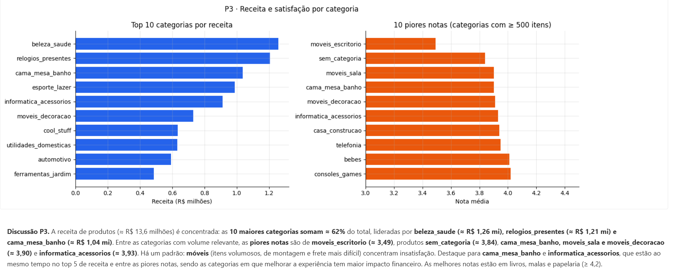

**Discussão:** a receita (~R$ 13,6 mi em produtos) é concentrada: **as 10 maiores categorias somam 62%**. As piores notas se
concentram em **móveis** (escritório, sala, decoração), produtos volumosos e de montagem, com frete mais difícil. O achado mais
acionável é que **cama_mesa_banho e informatica_acessorios estão ao mesmo tempo no top 5 de receita e entre as piores notas**.
São as categorias em que melhorar a experiência tem maior retorno financeiro. As melhores notas estão em livros, malas e papelaria (≥ 4,2).

### P4. Evolução mensal e sazonalidade

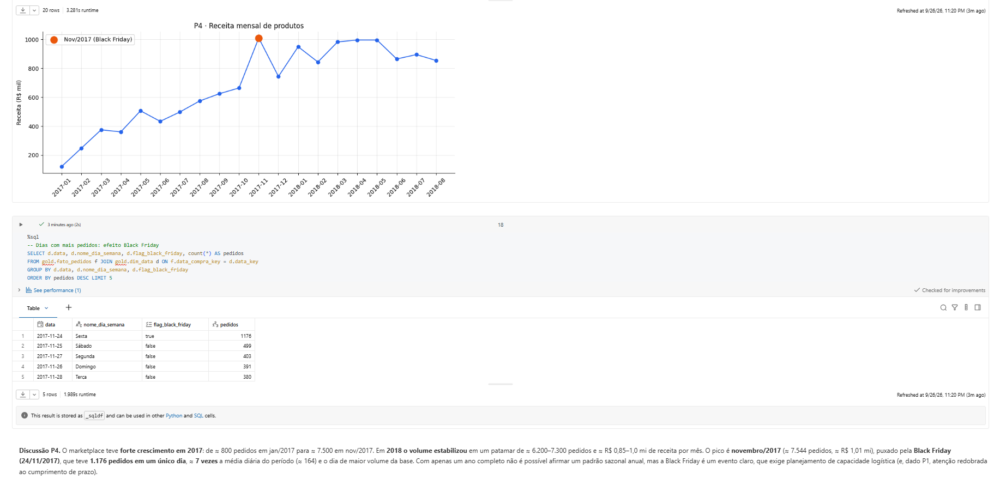

| Destaque | Valor |
|---|---|
| Jan/2017 → Nov/2017 | 800 → 7.544 pedidos/mês (**~9 vezes**) |
| Patamar em 2018 (jan–ago) | 6.200–7.300 pedidos/mês; R$ 0,85–1,0 mi/mês |
| Mês recorde | **Nov/2017**: 7.544 pedidos, R$ 1,01 mi |
| Dia recorde | **24/11/2017 (Black Friday)**: 1.176 pedidos, ~7 vezes a média diária (164) |

**Discussão:** o marketplace **cresceu rapidamente ao longo de 2017 e estabilizou em 2018**. O pico de novembro/2017 é explicado
pela **Black Friday**, o dia de maior volume de toda a base. Com apenas um ano completo não é possível confirmar um padrão
sazonal anual, mas a Black Friday é um evento claro de estresse logístico. Somado à P1, isso indica a necessidade de planejar
capacidade e prazos prometidos para esse período. Meses incompletos (set–dez/2016 e set–out/2018) foram excluídos do gráfico.

### P5. Pedidos interestaduais × mesma UF

| Tipo de envio | % pedidos | Prazo médio | Prazo prometido | % atraso | Frete médio | Frete / produto (mediana) | Nota |
|---|---:|---:|---:|---:|---:|---:|---:|
| Mesma UF | 36% | **7,9 dias** | 18,2 | 4,6% | **R$ 15,19** | 18% | 4,28 |
| Interestadual | 64% | **15,1 dias** | 27,8 | 8,1% | **R$ 26,55** | 25% | 4,11 |

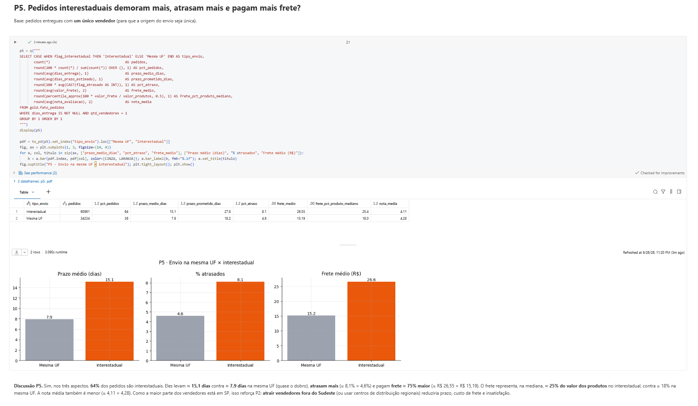

**Discussão:** sim, nos três aspectos. Os pedidos interestaduais (64% do total) levam **quase o dobro do tempo**, atrasam
**~1,8 vezes mais** e pagam **~75% mais frete**; na mediana, o frete chega a 25% do valor do produto. A nota também é menor.
Como a base de vendedores está concentrada em SP, **atrair vendedores em outras regiões** (ou usar centros de distribuição regionais)
reduziria prazo, custo e insatisfação ao mesmo tempo.

### P6. Formas de pagamento e parcelamento

| Forma principal | % pedidos | % valor | Ticket médio |
|---|---:|---:|---:|
| credit_card | **75,4%** | **78,4%** | R$ 167 |
| boleto | 19,9% | 17,9% | R$ 145 |
| voucher | 3,2% | 2,4% | R$ 120 |
| debit_card | 1,5% | 1,4% | R$ 143 |

| Cartão: parcelas | Pedidos | Ticket médio | Ticket mediano |
|---|---:|---:|---:|
| 1x | 24.006 | R$ 101 | R$ 72 |
| 2–3x | 22.649 | R$ 136 | R$ 111 |
| 4–6x | 16.160 | R$ 183 | R$ 128 |
| 7–9x | 6.507 | R$ 269 | R$ 181 |
| 10x+ | 5.653 | **R$ 415** | R$ 240 |

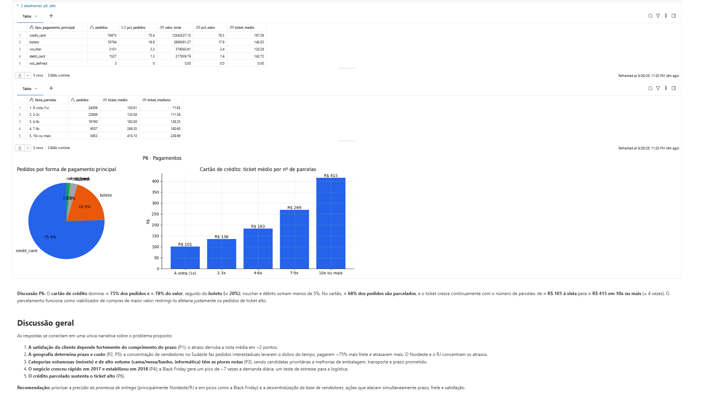

**Discussão:** o **cartão de crédito domina** (3 de cada 4 pedidos), seguido pelo boleto. No cartão, **68% dos pedidos são
parcelados**, e o ticket médio cresce continuamente com o número de parcelas, chegando a **~4 vezes** o valor à vista em 10x ou mais. O
parcelamento viabiliza as compras de maior valor e é, portanto, relevante para a receita.

### Discussão geral

As respostas formam uma narrativa coerente para o problema proposto:

1. **Satisfação depende de cumprir o prazo** (P1): o atraso custa ~2 pontos de nota.
2. **A geografia define prazo e custo** (P2, P5): a concentração de vendedores no Sudeste faz pedidos interestaduais levarem o dobro
   do tempo e pagarem ~75% mais frete. Os atrasos se concentram no Nordeste e no RJ.
3. **Móveis e categorias de alto volume, como cama/mesa/banho e informática, têm as piores notas** (P3) e merecem prioridade.
4. **O negócio cresceu ~9 vezes em 2017 e estabilizou em 2018** (P4); a Black Friday gera picos de ~7 vezes a demanda diária.
5. **O crédito parcelado sustenta o ticket alto** (P6).

**Recomendação:** priorizar a **precisão da promessa de entrega** (principalmente no Nordeste, no RJ e em picos como a Black Friday) e a
**descentralização da base de vendedores**, duas ações que atacam simultaneamente prazo, frete e satisfação.

---

## 7. Autoavaliação

**Atingimento dos objetivos.** Todas as 6 perguntas definidas no início foram respondidas com dados da camada Gold. O pipeline
cumpre o ciclo completo proposto: coleta com licença documentada, armazenamento em nuvem (Volume + Delta), arquitetura medalhão,
Esquema Estrela, catálogo de dados no Unity Catalog com domínios, linhagem e PK/FK, verificação de qualidade antes e depois das
transformações, e análise com discussão. O pipeline é reprodutível: pode ser executado do zero por um Job, com validações que
interrompem a execução se houver inconsistência.

**Limitações.**
- A P4 tem apenas **um ano completo** (2017), então não é possível afirmar sazonalidade anual; apenas o efeito da Black Friday é claro.
- As análises são **descritivas/correlacionais**: a P1 mostra associação forte entre atraso e nota, mas não isola outros
  fatores (ex.: qualidade do produto) como uma análise causal faria.
- A P5 considera apenas pedidos com um único vendedor (~98% dos pedidos entregues), para que a origem do envio fosse única.
- A carga é **completa (overwrite)**; em um cenário real com dados novos diários, seria mais adequada uma carga incremental.

**Dificuldades.**
- Leitura dos CSVs: os comentários das avaliações têm quebras de linha, e sem `multiLine` os registros eram quebrados.
- A tabela de geolocalização tem mais de 1 milhão de pontos, com vários por CEP. Usá-la diretamente em JOIN multiplicaria as linhas, então
  foi preciso agregá-la por CEP.
- Decidir o tratamento de avaliações duplicadas e de datas inconsistentes sem descartar informação útil.
- Escolher a granularidade do modelo: as perguntas exigiam dois grãos (pedido e item), o que levou a duas tabelas fato.

**Trabalhos futuros.**
- Carga **incremental** com Auto Loader / `MERGE` e orquestração agendada.
- **Dashboard** no Databricks (AI/BI Dashboards) consumindo a Gold.
- Usar a **distância geográfica** real vendedor–cliente (lat/lng já disponíveis) em vez da flag interestadual.
- Análise de **texto dos comentários** (NLP) para entender os motivos das notas baixas.
- Modelo preditivo de **risco de atraso** no momento da compra.
- Testes de qualidade declarativos com *expectations* (Lakeflow Declarative Pipelines).

---

## 8. Como reproduzir

1. Crie uma conta no [Databricks Free Edition](https://www.databricks.com/learn/free-edition).
2. Em *Workspace → Create → Git folder*, clone este repositório.
3. Execute [`notebooks/01_setup`](notebooks/01_setup.py) para criar os schemas e o Volume.
4. Baixe o dataset no [Kaggle](https://www.kaggle.com/datasets/olistbr/brazilian-ecommerce) e faça upload dos 9 CSVs no Volume `olist.bronze.landing`.
5. Execute os notebooks `02` a `08` em ordem, ou crie um Job com uma tarefa por notebook encadeadas nessa ordem.

> Se o workspace não permitir criar o catálogo `olist`, o `00_config` usa automaticamente o catálogo `workspace`, com a mesma estrutura de schemas.

### Estrutura do repositório

```
├── README.md                 ← documentação do MVP
├── LICENSE                   ← MIT (código)
├── notebooks/
│   ├── 00_config.py          ← parâmetros compartilhados
│   ├── 01_setup.py           ← schemas + Volume
│   ├── 02_bronze.py          ← ingestão CSV → Delta
│   ├── 03_qualidade_bronze.py← perfil de qualidade
│   ├── 04_silver.py          ← limpeza e padronização
│   ├── 05_gold.py            ← modelo estrela
│   ├── 06_catalogo_dados.py  ← catálogo no Unity Catalog
│   ├── 07_validacao_gold.py  ← testes da Gold
│   └── 08_analise.py         ← respostas P1–P6
└── docs/img/                 ← screenshots das evidências
```

**Tecnologias:** Databricks Free Edition (serverless) · Unity Catalog · Delta Lake · PySpark · Spark SQL · Matplotlib.
